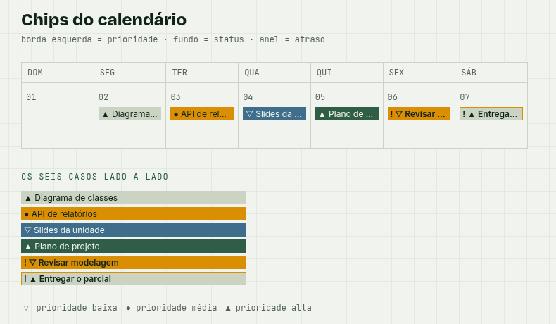
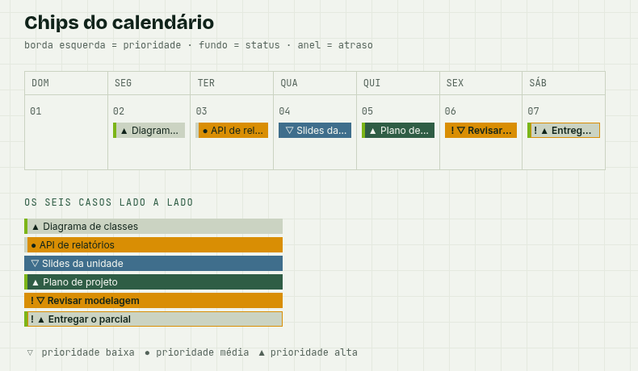

# Imagens de documentação

## `calendario-prioridade-antes.png` / `calendario-prioridade-depois.png`

Documentam a correção do `content` do `tailwind.config.ts` (PR #1), que
acrescentou `./lib/**/*.{ts,tsx}` à lista de arquivos escaneados.

`CLASSES_PRIORIDADE` e `CLASSES_COR_FRENTE` guardam classes inteiras como
texto em `lib/types.ts`, mas o Tailwind só gera CSS para classe que aparece
literalmente num arquivo escaneado. Como `lib/` estava fora do `content`,
cinco classes nunca chegaram ao CSS final:

```
.border-l-4   .border-broto   .text-broto   .bg-broto   .border-ferro
```

Efeito prático: **a borda esquerda de prioridade do calendário nunca
renderizou**, em nenhuma prioridade — a hierarquia de três camadas descrita
no `CLAUDE.md` (atraso > prioridade > status) rodava com duas, o glifo
`▲ ● ▽` e o anel de atraso.

### Antes

Os chips saem rentes: alta, média e baixa ficam idênticas na camada de borda.



### Depois

Borda `broto` na alta, `linha` na média, vão transparente na baixa.



### Por que estão versionadas

O commit do `content` altera o `/calendario` sem tocar no código dessa
página, o que isolado parece regressão. Estas duas capturas são a prova do
contrário, e precisam sobreviver ao PR — daí estarem no repositório e não
só anexadas na descrição.

Foram renderizadas com o mesmo componente e os mesmos dados, variando só o
`content`. A página de prova usava exclusivamente `CLASSES_PRIORIDADE`, sem
nenhuma classe escrita literal, que é a condição exata em que o bug aparece:
bastaria digitar `border-l-4` no arquivo de prova para o Tailwind gerar a
classe e o bug sumir, provando nada.
